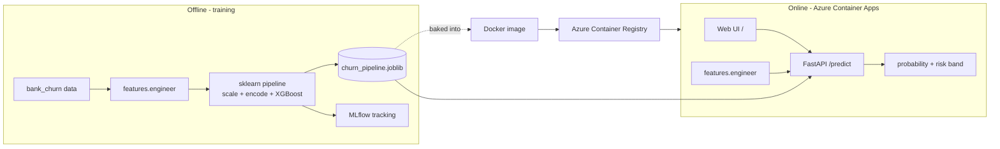

# Bank Customer Churn — MLOps on Azure

An end-to-end machine-learning service that predicts whether a bank customer is about to leave — **trained, containerised, and deployed live on Microsoft Azure** with a public web interface. The point of the project is not the model alone, but shipping it the way models are shipped in production: reproducible training, a containerised API, train/serve parity, and a real cloud deployment that scales to zero.

### Live demo
**https://churn-api.ambitiousbush-353c72ac.southeastasia.azurecontainerapps.io/**

> Hosted on Azure Container Apps with scale-to-zero. The first request after an idle period takes a few seconds while the container wakes up (a cold start) — this is the trade-off that keeps it running at near-zero cost.


---

## What it does

Enter a customer's profile — credit score, age, balance, products held, activity, and so on — and the service returns the **probability that they will churn**, a **low / medium / high risk band**, and a suggested action. A bank would use this to target retention offers at customers who are actually at risk.

## Tech stack

| Layer | Technology |
|-------|-----------|
| Model | XGBoost (gradient-boosted trees) in a scikit-learn pipeline |
| Tracking | MLflow (metrics, parameters, model versioning) |
| Serving | FastAPI + Uvicorn |
| Web UI | HTML / CSS / vanilla JS, served by the API itself |
| Packaging | Docker |
| Cloud | Azure Container Apps + Azure Container Registry |

## Architecture



The key design rule: **training and serving import the same feature-engineering module** (`src/features.py`). Because the identical transformation runs in both places, the model can never be fed differently-shaped inputs in production than it saw in training — this prevents *train/serve skew*, one of the most common silent causes of models that pass testing but fail live.

## Model performance

| Metric | Value | Meaning |
|--------|-------|---------|
| ROC-AUC | 0.76 | Ranks a random churner above a random non-churner 76% of the time |
| Recall (churn) | 0.67 | Catches about two-thirds of customers who actually churn |
| Precision (churn) | 0.39 | Of those flagged, ~39% truly churn — acceptable for retention outreach |

Class imbalance (~20% churn) is handled by up-weighting the minority class, trading some precision for higher recall — the right call when missing a churner is the costly error. The model is trained on a synthetic dataset with the same schema as the public bank-churn dataset, so swapping in real data changes nothing downstream.

## API endpoints

| Endpoint | Description |
|----------|-------------|
| `GET /` | Web interface (the form) |
| `GET /docs` | Interactive Swagger API docs |
| `GET /health` | Liveness check + whether the model is loaded |
| `POST /predict` | One customer to churn probability + risk band |
| `POST /predict/batch` | Score a list of customers |

## Project structure

```
churn-mlops/
├── src/
│   ├── features.py        single source of truth for feature engineering
│   └── train.py           train -> evaluate -> MLflow -> save artifact
├── app/
│   ├── main.py            FastAPI service (serves the web UI + endpoints)
│   ├── schema.py          request/response validation
│   └── templates/index.html   the web interface
├── data/generate_data.py  synthetic dataset generator
├── deploy/                Azure deploy + update scripts (PowerShell & bash)
├── Dockerfile             lean serving image
├── make.py                cross-platform task runner (no make needed)
└── requirements*.txt
```

## Run locally

```bash
python make.py all      # create venv + generate data + train the model
python make.py serve    # run the API + web UI on http://localhost:8000
```

Then open `http://localhost:8000/` in a browser. (`make.py` is a pure-Python task runner, so it works the same on Windows, macOS, and Linux.)

## Deploy to Azure

```powershell
# one-time: az login, then from the repo root
powershell -ExecutionPolicy Bypass -File .\deploy\deploy.ps1
```

The script builds the image locally, pushes it to Azure Container Registry, and deploys it to Container Apps with a public HTTPS URL and scale-to-zero. To roll out a new version into the running app (keeping the same URL):

```powershell
powershell -ExecutionPolicy Bypass -File .\deploy\update-api.ps1
```

Tear everything down when done:

```powershell
az group delete --name rg-churn-demo --yes --no-wait
```

## Notable engineering decisions

- **Train/serve parity** via a shared feature module — a deliberate anti-skew choice.
- **Scale-to-zero serving** — near-zero cost when idle, accepting a cold-start latency trade-off.
- **Self-contained web UI** served by the API — one container, one URL, no separate frontend to host.
- **Local-build-and-push deployment** — works on Azure for Students, which blocks cloud-side image builds.
- **Cross-platform tooling** — a Python task runner replaces `make` so the workflow runs on native Windows.

## Limitations & next steps

- Trained on synthetic data; real data would need validation and ongoing monitoring.
- No automated retraining or drift detection yet — a natural next step.
- Predictions are not persisted; logging them to a cloud database would add an audit trail and enable drift monitoring.
- Single region, single small replica — appropriate for a demo, not production scale.

## License

MIT — see [LICENSE](LICENSE).